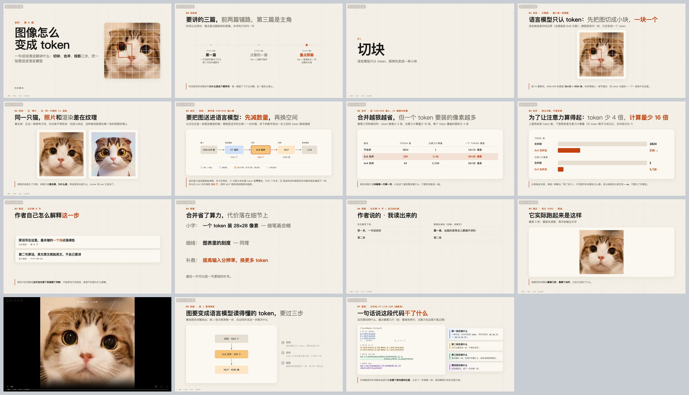

# tech-talk-deck

> 基于 [skJack/kelip-slide](https://github.com/skJack/kelip-slide)（MIT）改造，原名 kelip-slide。
> 上游 `LICENSE` 原样保留在本目录，改了什么见 [UPSTREAM.md](UPSTREAM.md)。

用**单个 HTML 文件**做技术讲解幻灯片：1920×1080，暖纸底 + 浅网格 + 墨字 + 一个赭橙强调色，
一页一张大图，图示五色语义，字号偏大。Chrome 双击就能放，方向键翻页，断网可用。
每页带一行「看哪里」和一块讲稿，**发给别人自己看也能懂**，不依赖录屏或现场讲解。

**一套模板 + 一份写给 AI Agent 看的规范。** 规范里除了版式，还有一组写页硬规则——
标题先说目的再说做法、结论先行、图先全出再逐项高亮、数字画成图、页上不写免责声明——
都是几十期讲解 deck 被读者反复纠正后沉淀下来的（理由和正反例见 `references/style.md`）。
给你的 agent（Claude Code、Cursor、Codex、Copilot……）指一下这个目录，说「做一个讲 X 的 deck」，它就按这套搭；
人自己动手也行，`assets/deck-template.html` 就是一份可以直接改的模板。
想要上游的苹果浅灰风，在 `<html>` 上加 `data-theme="keynote"` 即可。



## 为什么是 HTML 不是 PPTX

- 录屏清晰，缩放不糊，字体不会因为换机器变形
- 机制图想画就画（内联 SVG），改数据不用回 Illustrator
- 视频直接嵌，翻到自动播、翻走自动停
- 改一行字不用重新导出，`git diff` 看得见改了什么
- 一个文件夹发给别人就能看，不装任何软件

## 安装

**Claude Code**（装成 skill，会自动触发）：

```bash
git clone https://github.com/ManagerZhang10/algorithm-engineer-skills.git
ln -s "$PWD/algorithm-engineer-skills/skills/tech-talk-deck" ~/.claude/skills/tech-talk-deck
```

**其他 AI Agent**（Cursor / Codex / Copilot / 自己写的 agent）——clone 到项目里，
让 agent 读 `SKILL.md` 就行：

```bash
git clone https://github.com/ManagerZhang10/algorithm-engineer-skills.git
cp -r algorithm-engineer-skills/skills/tech-talk-deck tools/tech-talk-deck
```

然后在项目的 `AGENTS.md` / `.cursorrules` / 系统提示里加一句：

```
做幻灯片 / deck / slides 时，先读 tools/tech-talk-deck/SKILL.md，按它的版式和流程做。
```

（仓库根目录自带一份 `AGENTS.md`，会读这个约定的 agent 不用你额外配。）

**不用 agent**：跳到[手动用模板](#方式二手动用模板)。

---

## 用法

### 方式一：让 AI Agent 搭

装完直接说需求就行（Claude Code 装成 skill 的话会自己找过来，
其他 agent 提一句「按 tech-talk-deck 的规范来」）：

```
用 tech-talk-deck 做一个 deck，讲 XXX 论文，图在 ./paper/figures，我要讲 15 分钟
```

```
这个产品发布会的 deck 帮我搭一下，素材：官网截图在 ./shots，demo 视频 ./demo.mp4
```

改的时候直接说人话，不用提页号以外的术语：

```
第 7 页图太小            第 3 页拆成两页            把第 12 页换成自绘的流程图
整体换成深色             换回浅灰 keynote 风         把这三个数字画成长度条
```

它会做四件事：复制模板 → 逐页填 → **渲染成缩略图自己看一遍** → 把图给你确认。
最后你会拿到一个 `deck/` 文件夹：`deck.html` + `media/` + 一张全页预览。
（第三步是这套规范里最要紧的一条——`SKILL.md` 明确要求 agent 先把 deck 渲染成图自己检查一遍，
而不是写完 HTML 就交差。能看图的 agent 都该这么用。）

想提高一次成型率，动手前先把这三样给它：**素材放哪**、**讲多久 / 多少页**、
**每段要讲什么**（一句话一段就够）。

### 方式二：手动用模板

```bash
mkdir -p mydeck/media && cd mydeck
cp <tech-talk-deck 目录>/assets/deck-template.html deck.html   # Claude Code: ~/.claude/skills/tech-talk-deck
cp <tech-talk-deck 目录>/assets/{render_pages.sh,render_preview.py,check_arrows.py} .
open deck.html          # Linux: xdg-open
```

模板里 15 种页型各有一个填好的示例页，按注释编号找（`<!-- ===== 4 一图页 ... -->`），
删掉用不上的，剩下的照着改。图片视频都放 `media/`，用相对路径引。

**一页的结构**固定是五件套（kicker / 标题 / sub / 主体 / 讲稿），最常用的一图页长这样：

```html
<section class="slide" data-sec="02 架构" data-title="一份输入，三条分支">
  <div class="kicker"><b>02</b>架构 · 论文图 3 · 出处口径写这里</div>
  <h1>一份输入，<span class="thin">三条互不相见的分支</span></h1>
  <div class="sub">图页必填：这张图看哪里</div>
  <div class="fig card"></div>
  <div class="talk">讲稿 2–4 句：本来要口头讲的话。</div>
</section>
```

- `data-sec` 是段名（左上角页面列表按它分组），`data-title` 是列表里显示的标题，**都要填**
- `.kicker` 放段号 + 段名 + 这页的出处；`<h1>` 先写目的再写做法或结论；`<span class="thin">` 压灰次要半句，
  `<span class="acc">` 点一个数字，一页最多点一处
- `.fig.card` 的白卡尺寸由 JS 按图片真实比例算，宽图不会上下留白——**别给它写死宽高**

放数字的页——**画成长度，不做数字卡**：

```html
<section class="slide" data-sec="02 合并" data-title="省了多少">
  <div class="kicker"><b>02</b>合并 · 按公式算，不是实测</div>
  <h1>为了让注意力算得起：<span class="thin">token 少 4 倍，</span><span class="acc">计算量少 16 倍</span></h1>
  <div class="sub">上面是 token 数，下面是注意力计算量（与 token 数平方成正比，合并前记为 1）</div>
  <div class="bars">
    <div class="grp">TOKEN 数</div>
    <div class="bar"><div class="l">合并前</div><div class="track"><div class="fill" style="--w:100%"></div></div><div class="v">1024</div></div>
    <div class="bar hi"><div class="l">合并后</div><div class="track"><div class="fill" style="--w:25%"></div></div><div class="v">256</div></div>
  </div>
  <div class="talk">讲稿 2–4 句：这组数字意味着什么。</div>
</section>
```

其余页型（自绘 SVG、表、原话卡、视频页、分步高亮……）照抄模板里对应的示例页。

### 排完一定要渲染出来看

版式对不对别靠脑补，逐页截图拼成一张缩略图看：

```bash
python3 render_preview.py deck.html 30 /tmp/deck-render 1
open /tmp/deck-render/contact.png
```

（`30` 是页数，最后的 `1` 是缩放倍数。需要 `pip install pillow` 和本机装了 Chrome，
路径不对就 `CHROME=/path/to/chrome python3 render_preview.py ...`）

重点看：图是不是顶到卡边、卡片是不是空了一半、表格有没有挤成一团、标题有没有压住图。
单页放大看 `/tmp/deck-render/slide-07.png`。

有自绘图的话再跑一遍箭头检查（箭头悬空、打偏、穿过别的块，肉眼在缩略图上很难看出来）：

```bash
python3 check_arrows.py deck.html
```

### 放映和录屏

`F` 进全屏，剩下的就是方向键。录屏把浏览器窗口调成 16:9（1920×1080 或 1280×720），
全屏后整页就是画面。视频页翻到就自动静音循环播，翻走自动暂停，不用手点。
临时要跳页就敲数字键，或者 `G` 打开左上角的页面列表点选。

### 键位

| 键 | 作用 |
|---|---|
| `→` `空格` `↓` / `←` `↑` | 翻页 |
| `Home` / `End` | 首页 / 末页 |
| 数字键 | 跳页（两位数连按） |
| `F` | 全屏 |
| `C` | 显示 / 隐藏页码 |
| `G` 或左上角 `☰` | 展开页面列表 |
| `J` / `K` | 分步高亮页的下一步 / 上一步 |

点击页面不翻页（防误触），鼠标用户点左上角 `‹ ›`。
地址栏 `deck.html#10` 直接开第 10 页，`?nav=1` 打开时展开列表，`?anim=2#14` 停在分步高亮第 2 步。

---

## 里面有什么

| 文件 | 用途 |
|---|---|
| `SKILL.md` | 给 agent（和人）看的规范：版式系统、15 种页型速查、写页硬规则、自查回路、常见坑 |
| `AGENTS.md` | 一行指路，给会自动读它的 agent |
| `assets/deck-template.html` | 模板：全部组件 CSS + 导航 JS + 每种页型一个示例页 |
| `assets/render_pages.sh` | 只截指定页（改完页后的默认自查） |
| `assets/render_preview.py` | 逐页渲染成 PNG 并拼成缩略图 |
| `assets/check_arrows.py` | 检查自绘图的箭头有没有对准块、有没有穿过别的块 |
| `references/style.md` | 写页规则的理由和正反例、视觉 token 的来历 |
| `references/svg.md` | 自绘机制图：坐标系、五色语义配色类、四种画法、箭头自动连线、分步高亮 |
| `references/media.md` | 素材处理：PDF 转图、裁白边拼图、切视频、网页截图 |
| `references/customize.md` | 改造：换主题 / 配色 / 字体 / 画幅、导出 PDF |
| `assets/media/` | 示例页用的猫图 |

页型：封面 · 时间线 · 过渡页 · 一图页 · 两图并排 · 自绘 SVG · 表 · 长度条 · 原话卡 ·
大字页 · 两列清单 · 视频页 · 满屏播片 · 分步高亮 · 代码解读，外加图片网格、并排大卡、四步条、代码卡。

## 常见问题

**图不显示** — 路径要相对 `deck.html`（`media/x.png`），别用绝对路径；
文件名大小写在 macOS 上无所谓，传给别人可能就有所谓了。

**视频不自动播** — 必须有 `muted`，浏览器不允许带声音自动播放。

**字变成了衬线体** — SVG 里的 `<text>` 要挂在 `class="sv"` 的元素下面，
或者自己写 `font-family`。

**想要右下角出处小字** — 模板内置 `.src`，页里加 `<div class="src">出处</div>` 即可。

**想换画幅 / 配色 / 字体** — 看 `references/customize.md`。换强调色改
`:root` 里 `--accent` 和 `--accent-soft` 两行；整体换回上游浅灰风加 `data-theme="keynote"`。

**导出 PDF** — 用 `render_preview.py` 出单页 PNG 再合成（`img2pdf slide-*.png -o deck.pdf`），
比浏览器打印靠谱。

## 关于内容

版式框架是固定的；写页规则分两档：`SKILL.md` 里标「硬规则」的是被读者反复纠正过的，建议照做；
标「建议」的（页数区间、段落结构等）按你自己的需要推翻。项目里有自己的风格约定时，以你的约定为准——
改 `SKILL.md` 里那一节，你的 agent 就跟着变。

## License

上游 kelip-slide 为 MIT（`LICENSE`，版权归 skJack），本目录的改动随本仓库的 MIT 发布。
示例图 `assets/media/` 中的猫图可随模板一起使用。
